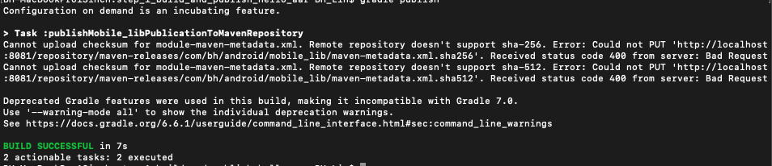
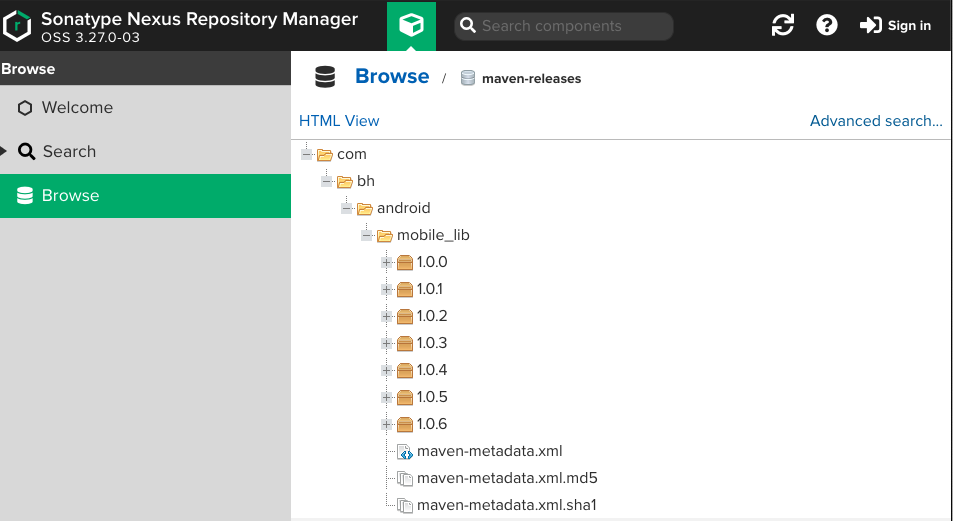
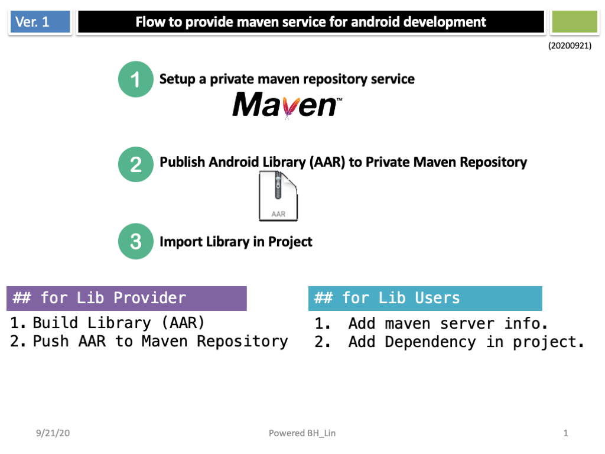
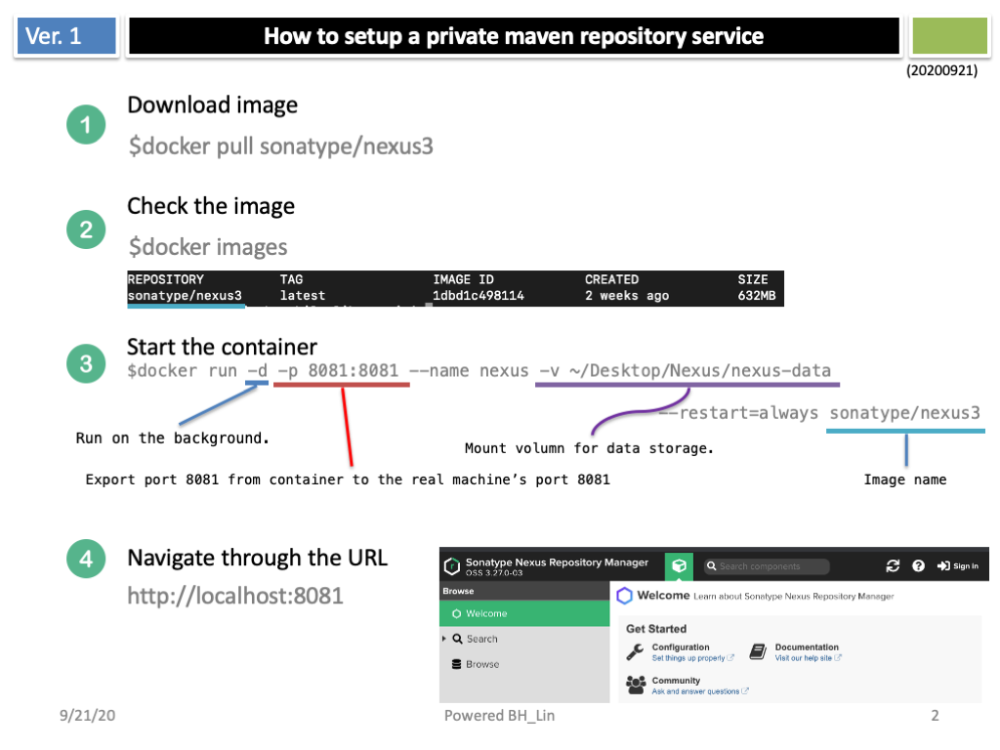
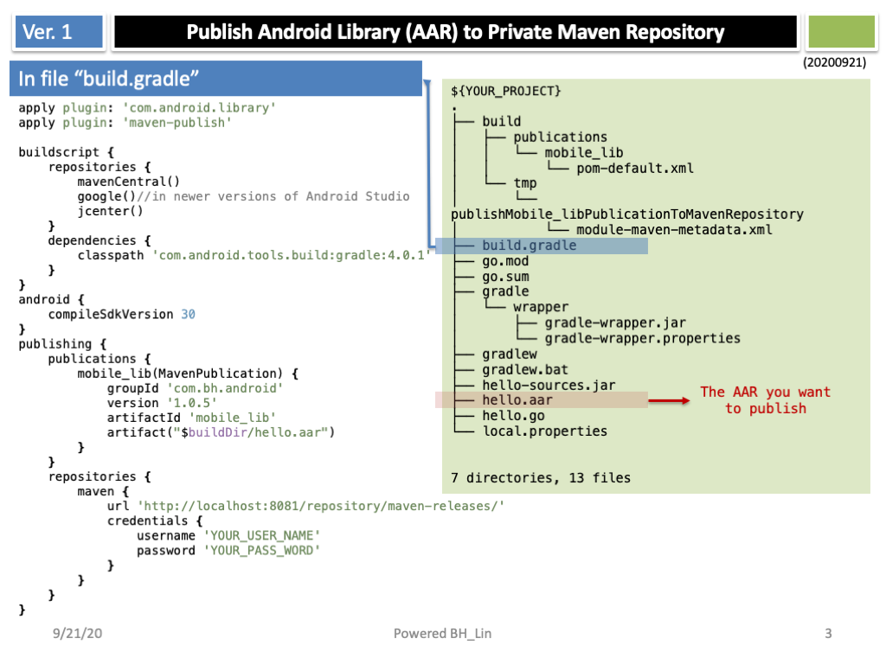
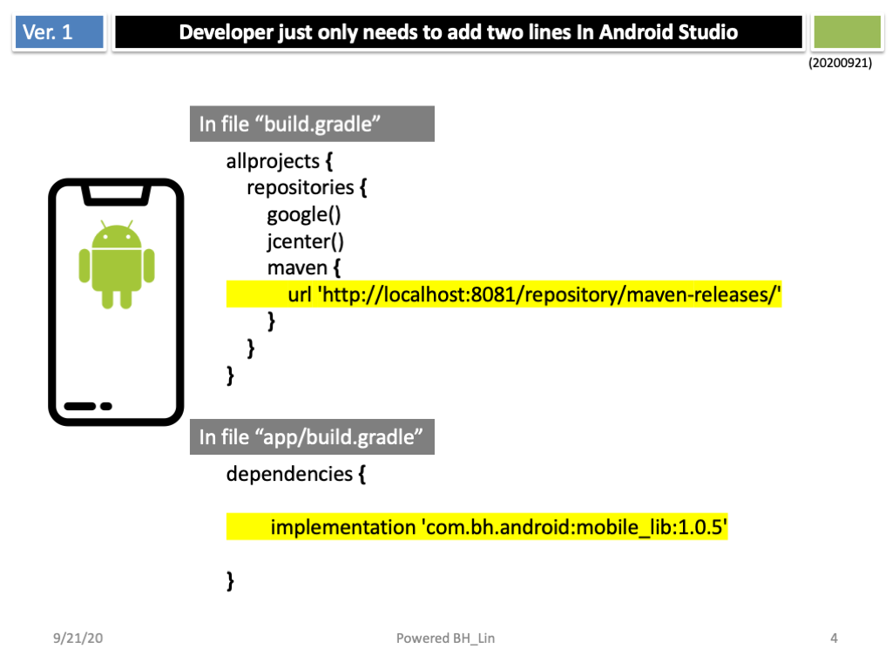
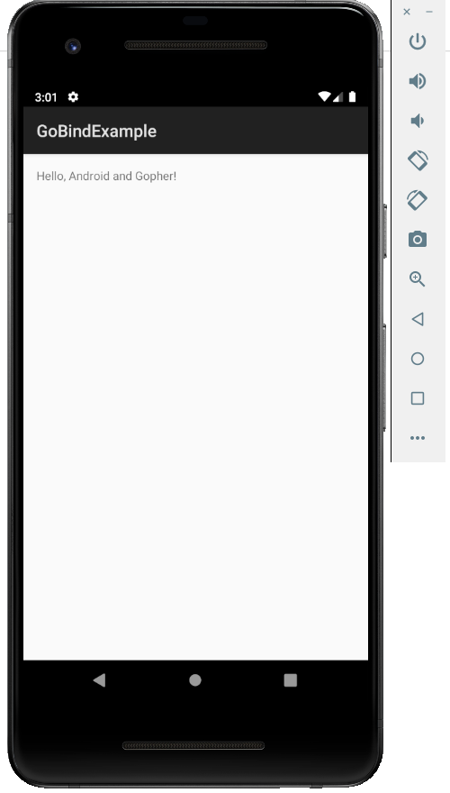

# Project: my-maven-publication
An example to publish AAR to private maven repository

## Build hello.aar
<code>
cd step_1_build_and_publish_hello_aar   
gomobile bind -target=android	
</code>

## publish hello.aar to private maven repository
<code>
cd step_1_build_and_publish_hello_aar   
gradle publish  
</code>  

## Finally, you can see a new package on repository

## Illustration: 

